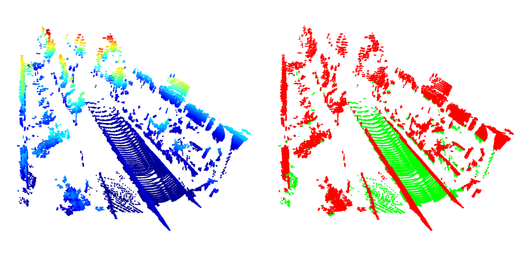

# Lidar Point Cloud Ground Segmentation Using PatchWork++

Add **getGroundIndices()** and **getNongroundIndices()** methods to [patchwork++](https://github.com/url-kaist/patchwork-plusplus) with the aim of outputting **x,y,z,intensity** lidar point cloud.

```shell
sudo apt install libyaml-cpp-dev
sudo apt install libpcl-dev
mkdir build
cd build
cmake .. && make
./main
```



To Do:

- [ ] Compare patchwork++ with pcl::SACSegmentation